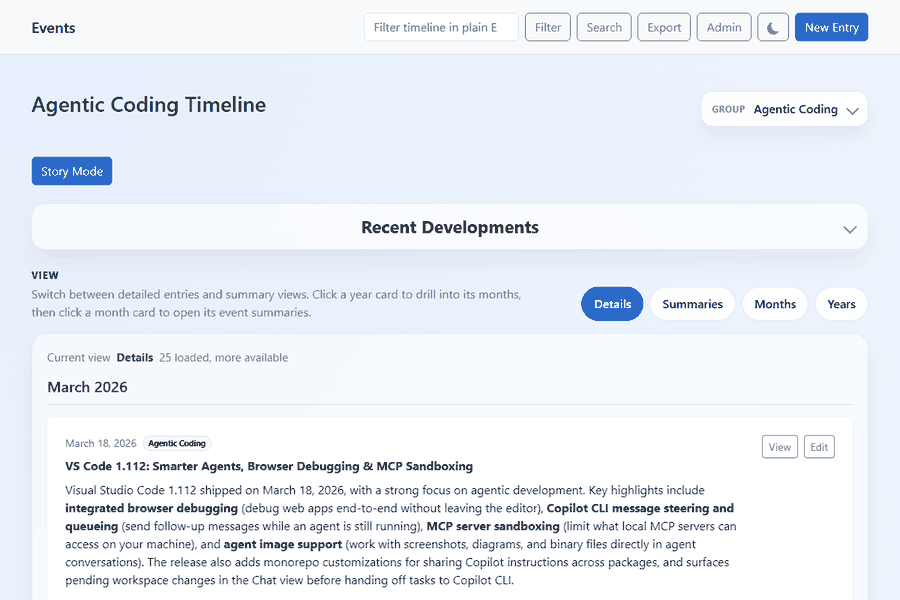
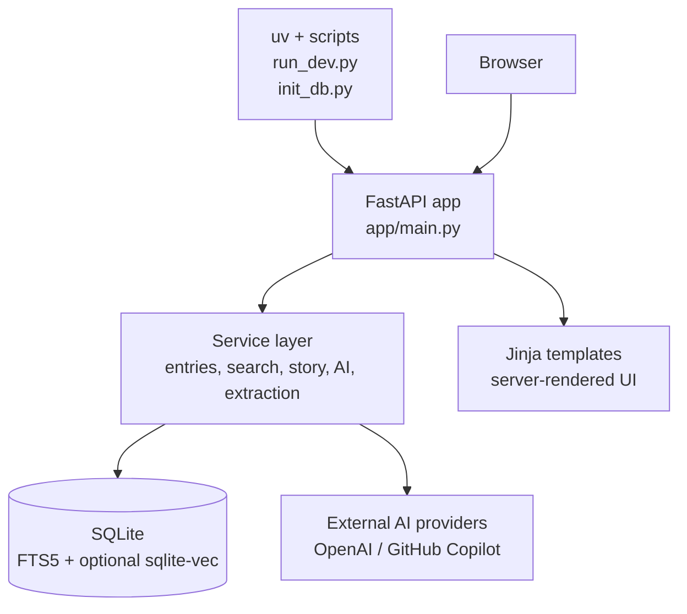
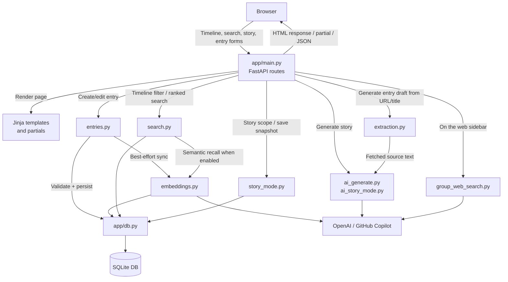
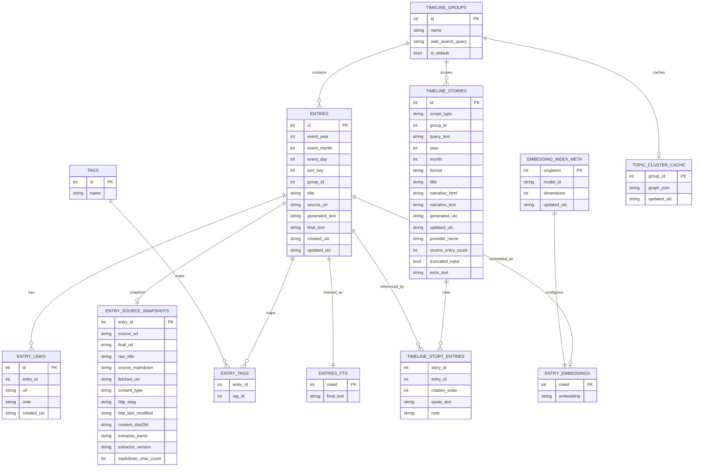

# EventTracker

EventTracker is a local-first timeline application built with FastAPI, SQLite, Jinja2, Bootstrap, SQLite FTS5, and optional sqlite-vec embeddings. It is a single-process, server-rendered app: entries are stored in one SQLite file, pages are rendered on the server, and the browser layer is limited to lightweight JavaScript for view switching, pagination, previews, and AI-assisted workflows.

If you want a simpler version of what this app does, see [README_EXPLAIN_IT_TO_ME_LIKE_I_AM_5.md](README_EXPLAIN_IT_TO_ME_LIKE_I_AM_5.md).

## Demo



This demo shows the main AI-assisted workflow in EventTracker, from live web discovery to source-backed entry generation.

- Expanding the `Recent Developments` panel and loading Copilot-backed web results.
- Browsing the rendered results grid for recent, source-linked updates.
- Entering a source URL in `New Entry` and generating a suggested summary, title, and date.
- Reviewing the rendered preview before saving the entry.

Timeline Story Mode is also available in the current app. It lets you launch a narrative view from the timeline, a search scope, or drilled year/month buckets, generate a story over the current scope, save that story as a snapshot, and follow inline citations down to a linked reference list.

## Quick start

Run these commands from the repository root:

```powershell
uv sync
uv run python -m scripts.init_db
uv run python -m scripts.run_dev --reload
```

Then open `http://127.0.0.1:35231/` in your browser.

## Requirements documents

The canonical product requirements for the repository live in the split requirement sets under `docs/functional-requirements/` and `docs/non-functional-requirements/`.

Use this README as a high-level product and architecture overview. Use the requirement documents for implementation-aligned behavioral and operational contracts.

## Playwright end-to-end tests

EventTracker has two Playwright browser end-to-end suites:

- Python Playwright tests in `tests/e2e/`
- TypeScript Playwright tests in `tstests/e2e/`

Both suites run against a temporary copy of the SQLite database so the live `data/EventTracker.db` file is never modified.

Set up the test tooling once:

```powershell
uv sync --dev
npm install
uv run python -m playwright install chromium
```

Run the Python Playwright suite from `tests/e2e/`:

```powershell
uv run pytest tests/e2e
```

Run the TypeScript Playwright suite from `tstests/e2e/`:

```powershell
npm run test:e2e:ts
```

The Python suite uses the Playwright pytest harness in `tests/e2e/conftest.py`.

The TypeScript Playwright config and shared harness live in `playwright.config.ts` and `tstests/e2e/helpers/harness.ts`.

Future TypeScript specs should import `test` and `expect` from `tstests/e2e/helpers/harness.ts` instead of directly from `@playwright/test`. That harness mirrors the Python suite's isolation model: it copies `data/EventTracker.db` to a temporary file when present, launches EventTracker on a free local port, and tears the temporary database down after the test completes.

`npm run serve:e2e:ts` still starts a shared local server on `http://127.0.0.1:35231/` for manual debugging and `npm run codegen:e2e`, but the automated TypeScript suite is configured around the isolated harness instead of a shared web server.

The TypeScript suite currently includes specs for smoke tests, entry lifecycle (create/read/edit), timeline view switching, search result navigation, and heatmap visualization. Page Object Models in `tstests/e2e/poms/` cover the timeline, entry form, entry detail, search, and admin groups pages.

Useful TypeScript Playwright commands:

```powershell
npm run serve:e2e:ts
npm run test:e2e:ts -- tstests/e2e/heatmap.spec.ts
```

Useful environment variables:

- `EVENTTRACKER_PLAYWRIGHT_HEADLESS=0` launches Chromium visibly for debugging.
- `EVENTTRACKER_PLAYWRIGHT_SLOW_MO=250` slows browser actions by 250 ms.

The harness will:

- copy `data/EventTracker.db` to a temporary file when it exists
- launch EventTracker on an isolated local port
- give the suite a unique run id and dedicated Playwright group name
- discard the temporary database when the run completes

## Refreshing Demo Assets

With the app running locally, regenerate the screenshot set and the main demo GIF with:

```powershell
uv run --with pillow python .\scripts\generate_demo_assets.py
```

This writes refreshed PNG screenshots into `docs/demo-assets/screenshots/` and rebuilds `docs/demo-assets/EventTracker-demo-web-generate.gif`.

**Note:** The script drives a real browser session and waits up to 180 seconds for the Story Mode generation step to complete, so the full run can take two to three minutes. Let it finish without interruption.

To also build the alternate GIF that omits the filter and search action frames:

```powershell
uv run --with pillow python .\scripts\generate_demo_assets.py --also-no-search-actions
```

## What the application does today

- Creates and edits timeline entries with year, month, optional day, required group, required title, optional source URL, optional generated draft HTML, required final rich text, comma-separated tags, and optional additional links with required notes.
- Shows the main timeline at `/` with five views over the current scope: `Details`, `Summaries`, `Heatmap`, `Months`, and `Years`.
- Defaults the main timeline and ranked search to the current default timeline group. Users can switch to a specific group or `All groups`.
- Supports timeline filtering on `/` with the `q` query string. This keeps matches in timeline order instead of ranked order.
- Supports ranked search at `/search`, combining FTS matches with semantic matches when embeddings are available.
- Supports `Story Mode` for the current scope, turning matching entries into a narrative arc with sections, saved snapshots, and linked citations.
- Organizes entries into timeline groups, seeded with a default `Agentic Coding` group.
- Lets users create, rename, delete, and mark the default group at `/admin/groups`, and store an optional per-group web search query.
- Generates AI draft suggestions (with suggested tags) from either a title alone or a title plus extracted URL content. YouTube URLs are supported: the app extracts the video transcript and upload date via `youtube-transcript-api`, which the AI uses to generate a meaningful summary and infer the event date.
- Exports all saved entries as JSON from `/entries/export`.
- Imports legacy HTML lists or prior JSON exports with `scripts/import_entries.py`.
- Shows a Copilot-backed `On the web` sidebar for the selected group when that group has a stored web search query.
- Supports dark mode with automatic system preference detection and a manual toggle in the navbar.
- Generates AI topic tags for entries using `scripts/compute_topic_clusters.py`, and visualizes the resulting tag relationships as an interactive mind-map graph per timeline group.

## Current architecture

### Python code setup evaluation

The Python setup is coherent for a local-first product: it favors a small deployment footprint, direct execution, and low operational overhead over framework layering or packaging formality.

Strengths:

- `uv` plus `pyproject.toml` keeps dependency management, scripts, and type-check settings in one place.
- `[tool.uv] package = false` is a good fit for an application repo that is run directly rather than published as a distributable package.
- `scripts/run_dev.py` and `scripts/init_db.py` make operational entry points explicit instead of burying them in ad hoc shell commands.
- `app/main.py` acts as a clear composition root for FastAPI, Jinja, filters, and route wiring.
- `app/db.py` centralizes schema bootstrapping, SQLite feature enablement, FTS rebuilds, and sqlite-vec setup, which reduces hidden persistence behavior.
- The service layer is split by capability, not by framework artifact, which fits the product surface well: entries, search, story mode, extraction, embeddings, and AI integrations are easy to locate.
- Server-rendered templates keep the frontend simple and aligned with the single-process SQLite architecture.

Tradeoffs and risks:

- The app is intentionally not packaged as an installable Python project, which keeps it simple locally but makes reuse as a library or more formal distribution harder.
- Route handlers, page assembly, and orchestration are concentrated in `app/main.py`; that is pragmatic now, but it can become harder to navigate as feature count grows.
- Schema evolution is guarded in code rather than managed by a dedicated migration framework, which is lightweight but puts more pressure on startup-time compatibility checks.
- AI and embeddings are optional at runtime, which is a strength for graceful degradation, but it also means behavior can vary significantly across developer environments depending on `.env` configuration and installed capabilities.
- Pyright coverage is curated to selected files instead of the full tree, so some future regressions can still land outside the typed surface.

### Python architecture diagram



### Request flow diagram



### App shape

- Backend: FastAPI.
- Templates: Jinja2.
- Styling: Bootstrap plus custom CSS in `app/static/styles.css`.
- Theming: dark mode via Bootstrap 5.3 `data-bs-theme` attribute, CSS custom properties, `localStorage` persistence, and `prefers-color-scheme` detection.
- Persistence: SQLite in `data/EventTracker.db` by default.
- Search: SQLite FTS5 for keyword search and optional sqlite-vec for semantic recall.
- AI draft generation: provider abstraction in `app/services/ai_generate.py`.
- AI story generation: provider abstraction in `app/services/ai_story_mode.py`.

### Database model

The app currently stores:

- `timeline_groups`: top-level collections for entries, with optional `web_search_query` and `is_default`.
- `entries`: the main event records.
- `timeline_stories`: saved Story Mode snapshots for a specific scope and output format.
- `timeline_story_entries`: citation rows that preserve which entries were cited by a saved story and in what order.
- `topic_cluster_cache`: cached tag-graph JSON per group, keyed by group id, written by `scripts/compute_topic_clusters.py`.
- `tags` and `entry_tags`: normalized tag mapping.
- `entry_links`: additional per-entry websites with required notes.
- `entry_source_snapshots`: extracted source URL content stored as Markdown, one per entry. Populated on entry save when a source URL is present and extraction succeeds. For YouTube URLs, stores the video transcript and upload date.
- `entries_fts`: derived FTS5 index over `entries.final_text` only.
- `embedding_index_meta`: metadata for the embedding model and dimensions.
- `entry_embeddings`: sqlite-vec index when embeddings are configured and the extension is available.

Important implementation details:

- `title` is required.
- `final_text` is required.
- `group_id` is required when saving an entry.
- `sort_key` is derived as `YYYYMMDD`, using `00` when day is missing.
- Extracted URL content is stored in `entry_source_snapshots` as Markdown when a source URL is present and extraction succeeds.
- Saved Story Mode snapshots are stored as point-in-time results and are not auto-regenerated when entries change later.
- URL extraction fetches remote content server-side and is intended only for local or otherwise trusted deployments. YouTube URLs are detected and handled separately: the video transcript is fetched via `youtube-transcript-api` and the upload date is extracted from the page metadata.
- Embeddings are derived only from `final_text`.
- FTS indexes `final_text` only.
- AI-generated topic tags are merged into the normal tag set and persist across runs. Running the compute script again will not remove or duplicate existing tags.

### Database ER diagram



## Routes and workflows

### Timeline

`GET /`

- Loads the selected timeline scope.
- When `group_id` is omitted, defaults to the current default group.
- Supports `group_id=all` to show all groups.
- If `q` is present, uses the search service to find matching entry ids and renders a filtered timeline.
- Groups entries by month and year.
- Sorts entries newest first by `sort_key DESC`, then `updated_utc DESC`, then `id DESC`.
- Exposes client-side metadata so the browser can switch between `Details`, `Summaries`, `Heatmap`, `Months`, and `Years`.

Additional timeline endpoints:

- `GET /timeline/details`: paginated HTML payload for the details view.
- `GET /timeline/summaries`: HTML payload for summary groups, optionally scoped by year and month.
- `GET /timeline/heatmap`: metadata payload that tells the client to switch to the heatmap view.
- `GET /timeline/heatmap/entries`: paginated HTML payload for entries matching a heatmap date cell.
- `GET /api/heatmap`: JSON day-count data for the heatmap grid, optionally scoped by year and group.
- `GET /timeline/months`: month-bucket HTML payload, optionally scoped by year.
- `GET /timeline/years`: year-bucket HTML payload.

The timeline and its year/month drill views now also expose entry points into Story Mode for the current scope.

### Ranked search

`GET /search`

- Runs a ranked search only when `q` is present.
- Uses reciprocal rank fusion over:
  - FTS5 results from `entries.final_text`
  - semantic matches from sqlite-vec when enabled and configured
- Uses the same default-group and `All groups` scoping model as the timeline.
- Renders search-specific snippets with `<mark>` highlighting.

Additional search endpoint:

- `GET /search/results`: paginated HTML payload for additional ranked results.

The ranked search page also exposes a Story Mode launch action for the current query and selected group.

### Story Mode

`GET /story`

- Loads Story Mode for the current scope.
- Accepts `q`, `group_id`, `year`, `month`, and `format`.
- Uses the same default-group and `All groups` scoping model as the timeline and ranked search.
- Shows a server-rendered Story Mode page with scope summary, format selector, and current source-entry count.
- Shows a non-fatal warning if no entries match the requested scope.

`POST /story/generate`

- Generates a scoped story in one of three formats:
  - `executive_summary`
  - `detailed_chronology`
  - `recent_changes`
- Uses chronological entry context, even when the scope came from ranked search.
- Shows a visible in-page progress state while the request is being submitted.
- Returns a server-rendered page containing the generated narrative, inline citation jumps, and a save action.

`POST /story/save`

- Saves the generated story as a snapshot tied to the current scope.
- Stores the rendered narrative plus the exact cited entry ids and citation order.
- Redirects to the saved story page after success.

`GET /story/{id}`

- Loads a previously saved story snapshot.
- Keeps the bottom citation list linked to the original entry detail pages.
- Uses inline citation links inside the narrative to jump down to the matching citation in the reference list.

Story Mode UI behavior:

- Launch points exist on the timeline page, the ranked search page, and the year/month bucket cards.
- The generated narrative is organized into sections.
- Inline citations jump to the bottom citation list instead of leaving the story page.
- The bottom citation list still links to the actual entry detail pages.
- Saving a story preserves the current generated output as a snapshot.

### Entry create, view, and edit

`GET /entries/new`

- Renders a blank form.
- Preselects the first available timeline group.

`POST /entries/new`

- Validates year, month, optional day, group, title, source URL, additional links, and final text.
- Saves the entry, normalized tags, and additional links.
- Attempts embedding sync without failing the save path.
- Redirects to `/entries/{id}/view`.

`GET /entries/{id}/view`

- Renders a read-only event details page.
- Shows the saved final content, primary source URL, and additional links.

`GET /entries/{id}` and `POST /entries/{id}`

- Load an existing entry into the same form.
- Revalidate the same rules on update.
- Rewrite tags, replace additional links, and attempt best-effort embedding sync again.

### Draft generation and preview

`POST /entries/generate`

- Accepts `title`, `source_url`, and the current `generated_text` value.
- Requires either a title or a source URL.
- If a source URL is present, attempts extraction first.
- If extraction fails and a title exists, falls back to title-only generation.
- If extraction fails and there is no title, returns a server-rendered partial with an error.
- On success, returns a server-rendered partial containing generated draft HTML, a rendered preview, a suggested title, and suggested date fields.

This remains separate from Story Mode. Entry draft generation helps write one entry, while Story Mode helps narrate a whole scoped collection of entries.

`POST /entries/preview-html`

- Sanitizes arbitrary HTML entered in the form and returns the rendered preview partial used by the editor UI.

### Group administration

`GET /admin/groups`

- Lists all timeline groups with entry counts.
- Supports editing the group name, optional web search query, and default-group status.

`POST /admin/groups`

- Creates a new group if the normalized name is unique and non-empty.
- Can mark the new group as default.

`POST /admin/groups/{group_id}`

- Renames an existing group.
- Updates its optional web search query.
- Can set or clear its default-group status.
- Clears cached group web search results when the query changes.

`POST /admin/groups/{group_id}/delete`

- Deletes a group only when it is not the default group and has no entries.

### Group web search

These endpoints back the optional timeline sidebar for the selected group:

- `GET /timeline/group-web-search`
- `GET /timeline/group-web-search/stream`
- `POST /timeline/group-web-search/refresh`

Current behavior:

- Only available when `EVENTTRACKER_AI_PROVIDER=copilot`.
- Only active when the selected group has a stored `web_search_query`.
- Uses GitHub Copilot SDK to produce concise web results.
- Caches results in memory for a short TTL.
- Supports streaming status events over Server-Sent Events for the UI.

### Export and developer utilities

`GET /entries/export`

- Returns all entries as JSON.
- Includes tags and additional links in each exported entry payload.
- Uses a timestamped filename like `EventTracker-export-YYYY-MM-DD-HH-MM-SS.json`.

`GET /dev/extract`

- Fetches and extracts paragraph text from a source URL for debugging extraction behavior.
- YouTube URLs return the video transcript and upload date instead of page HTML.
- Intended for localhost or similarly trusted environments because it performs server-side fetches of the provided URL.

`GET /visualization`

- Redirects to `/` for backward compatibility.

### Topic clustering graph

`GET /groups/{group_id}/topics/graph`

- Renders the topic cluster visualization page for the selected group.
- Reads the cached tag graph from `topic_cluster_cache`.
- Shows an empty state with a prompt to run the compute script when no cache exists.

`GET /api/groups/{group_id}/topics`

- Returns the cached topic graph as JSON.
- Used by the client-side D3 renderer on the graph page.
- Returns `{"nodes": [], "edges": []}` when no cache is available.

Topic graph behavior:

- Each node represents a unique tag that appears on at least one entry in the group.
- Node size reflects the number of entries carrying that tag.
- Edges connect tags that co-occur on the same entry; edge thickness reflects co-occurrence strength.
- Clicking a node redirects to the timeline filtered by that tag label.
- Zoom in and zoom out buttons are available for touch-constrained environments.
- The graph uses D3 force simulation and respects the current dark/light theme.

To populate the graph, run the compute script:

```powershell
uv run python -m scripts.compute_topic_clusters
```

This script:

- Iterates over all timeline groups.
- For each entry, calls the configured AI provider to generate 2 to 5 topic tags.
- Merges the AI tags into the entry's existing tag set without removing user-assigned tags or duplicating existing ones.
- Builds a tag co-occurrence graph and writes it to `topic_cluster_cache`.
- Skips entries gracefully if AI generation fails for that entry.

## Search behavior

The app has two distinct search modes:

- Timeline filter on `/`: returns matching entries but preserves timeline ordering and timeline presentation.
- Ranked search on `/search`: returns ranked result cards with snippets.

Keyword search behavior:

- FTS queries are built from tokenized quoted terms.
- FTS ranking uses `bm25(entries_fts)`.
- Search snippets are produced with SQLite `snippet(...)` and sanitized before rendering.

Semantic behavior:

- Semantic search only runs when sqlite-vec is available and embedding settings are configured.
- Query embeddings and entry embeddings both use the OpenAI embeddings API.
- Ranked search fuses keyword and semantic lists with reciprocal rank fusion.
- Timeline filtering reuses ranked match ids, then sorts matching entries back into timeline order.

If embeddings are unavailable or misconfigured, the app still works and search falls back to keyword-only behavior.

## AI generation behavior

Draft generation currently supports two providers:

- `openai` (default)
- `copilot`

OpenAI mode:

- Uses `AsyncOpenAI`.
- Requires `OPENAI_API_KEY` and `OPENAI_CHAT_MODEL_ID`.
- Supports an optional `OPENAI_BASE_URL` for OpenAI-compatible providers.

Copilot mode:

- Uses `github-copilot-sdk`.
- Requires `EVENTTRACKER_AI_PROVIDER=copilot`.
- Uses `COPILOT_CHAT_MODEL_ID`, defaulting to `gpt-5`.
- Supports optional `COPILOT_CLI_PATH` and `COPILOT_CLI_URL` overrides.
- Also powers the optional group web search panel.

Both providers are asked to return strict JSON with this shape:

```json
{
  "title": "string",
  "draft_html": "string",
  "event_year": 2026,
  "event_month": 3,
  "event_day": 16,
  "suggested_tags": ["string"]
}
```

The app normalizes that response, strips known stray Unicode characters from generated HTML, and rejects empty or invalid payloads.

## Rich text rules

Saved `final_text`, generated previews, and manual preview rendering are sanitized before display.

Allowed tags in rich text:

- `p`
- `b`
- `strong`
- `i`
- `em`
- `u`
- `ul`
- `ol`
- `li`
- `br`
- `blockquote`
- `code`

Search snippets additionally allow `mark`.

## Runtime notes

Use the commands in [Quick start](#quick-start) to install dependencies, initialize the database, and start the development server. Then open `http://127.0.0.1:35231/` in your browser.

Default host and port:

- Host: `127.0.0.1`
- Port: `35231`

The run script loads `.env` with `override=False`, so explicit shell variables or `--host` and `--port` overrides take precedence over `.env` for that run.

On Windows, `--reload` also cleans up the previous EventTracker reload parent before starting a new one, which avoids the stale-listener state that can otherwise leave the port wedged after an interrupted dev session.

If you want a PowerShell session with the virtual environment activated:

```powershell
.\.venv\Scripts\Activate.ps1
```

## Configuration

### Core settings

```env
EVENTTRACKER_HOST=127.0.0.1
EVENTTRACKER_PORT=35231
EVENTTRACKER_DB_PATH=data/EventTracker.db
```

`EVENTTRACKER_DB_PATH` is optional. If omitted, the app uses `data/EventTracker.db`.

### Draft generation with OpenAI-compatible chat

```env
EVENTTRACKER_AI_PROVIDER=openai
OPENAI_API_KEY=your-api-key
OPENAI_CHAT_MODEL_ID=your-chat-model
OPENAI_BASE_URL=https://your-provider-compatible-endpoint/v1
```

`OPENAI_BASE_URL` is optional.

### Draft generation and group web search with GitHub Copilot SDK

```env
EVENTTRACKER_AI_PROVIDER=copilot
COPILOT_CHAT_MODEL_ID=gpt-5
```

Optional advanced overrides:

```env
COPILOT_CLI_PATH=
COPILOT_CLI_URL=
EVENTTRACKER_GROUP_WEB_SEARCH_TIMEOUT_SECONDS=90
EVENTTRACKER_GROUP_WEB_SEARCH_BROADENED_TIMEOUT_SECONDS=75
EVENTTRACKER_GROUP_WEB_SEARCH_REQUEST_TIMEOUT_MS=95000
```

The Copilot-powered group web search can take a while because it may do an initial pass and then a broadened second pass if the first result set is too sparse. The browser request also has its own timeout.

### Semantic embeddings

```env
OPENAI_API_KEY=your-api-key
OPENAI_EMBEDDING_MODEL_ID=your-embedding-model
OPENAI_BASE_URL=https://your-provider-compatible-endpoint/v1
```

Embeddings are optional. If they are not configured, entry save still works and search stays keyword-only.

To rebuild embeddings for existing entries:

```powershell
uv run python -m scripts.init_db --reindex-embeddings
```

## Import, backup, and restore

### Import

The import script accepts either:

- legacy HTML list content with `<li>`, `<h4>`, and `<p>` blocks
- exported JSON from `/entries/export`

Run it with:

```powershell
uv run python -m scripts.import_entries path\to\input.html
uv run python -m scripts.import_entries path\to\export.json
```

By default it skips exact duplicates based on date, title, and final text. To allow duplicates:

```powershell
uv run python -m scripts.import_entries path\to\export.json --allow-duplicates
```

Current import behavior:

- imported rows are inserted without embedding generation
- FTS remains available immediately
- embeddings can be rebuilt later
- imported entries are assigned to group id `1`, which is the seeded default group in a fresh database

### Refresh source snapshots

To batch extract or re-extract source URL content as Markdown snapshots for existing entries:

```powershell
uv run python -m scripts.refresh_source_snapshots             # all entries with a source_url
uv run python -m scripts.refresh_source_snapshots --missing    # only entries without a snapshot yet
uv run python -m scripts.refresh_source_snapshots --group 3    # limit to a specific group
uv run python -m scripts.refresh_source_snapshots --dry-run    # preview without fetching
```

YouTube URLs are automatically detected and processed using transcript extraction instead of HTML conversion. The script is rerunnable: existing snapshots are overwritten with fresh content.

### Backup and restore

The app stores all primary data in a single SQLite file.

- Stop the app before copying the database file.
- Back up `data/EventTracker.db` or the file pointed to by `EVENTTRACKER_DB_PATH`.
- Restore by replacing that file, then restart the app.
- Rebuild embeddings afterward if the restored database is older than the current embedding configuration.

## Verification

Run the test suite with:

```powershell
uv run pytest tests/
```

Run the static type check with:

```powershell
uv run pyright
```

Current automated coverage includes:

- app startup
- entry create, view, and edit flow
- timeline filter and ranked search behavior
- group administration rules
- generation partial behavior
- heatmap API behavior
- import parsing
- embeddings service behavior
- group web search behavior
- admin group CRUD (E2E)
- URL extraction
- HTML sanitization
- navigation and entry detail (E2E)
- search and topic graph (E2E)
- heatmap visualization (E2E)
- story mode (E2E)

## Project layout

```text
pyproject.toml
README.md
README_EXPLAIN_IT_TO_ME_LIKE_I_AM_5.md
app/  # FastAPI application package
  __init__.py
  db.py
  env.py
  main.py
  models.py
  schemas.py
  services/  # Domain services and provider adapters
    __init__.py
    ai_generate.py
    ai_story_mode.py
    copilot_runtime.py
    copilot_sdk.py
    embeddings.py
    entries.py
    extraction.py
    group_web_search.py
    search.py
    story_mode.py
    topics.py
  static/  # Static web assets
    styles.css
  templates/  # Server-rendered Jinja templates
    admin_groups.html
    base.html
    entry_detail.html
    entry_form.html
    search.html
    story.html
    timeline.html
    topic_graph.html
    partials/  # Reusable template fragments
      entry_card.html
      generated_preview.html
      heatmap_entries.html
      html_preview_content.html
      search_results.html
      story_links.html
      timeline_bucket_cards.html
      timeline_detail_groups.html
      timeline_summary_groups.html
data/  # Local SQLite database and runtime data
docs/  # Requirements and demo assets
scripts/  # Developer and maintenance entry points
  combine_and_optimize_pdf.py
  compute_topic_clusters.py
  generate_demo_assets.py
  generate_test_report.py
  import_entries.py
  init_db.py
  merge_and_shrink_pdf.py
  merge_pdfs.py
  refresh_source_snapshots.py
  run_dev.py
  test_cluster.py
  test_labels.py
tests/  # Unit and integration tests
  csrf_helpers.py
  e2e/  # Playwright end-to-end browser tests
    conftest.py
    test_admin_groups_crud.py
    test_core_workflows.py
    test_navigation_and_entry_detail.py
    test_optional_mocked_workflows.py
    test_search_and_topic_graph.py
    test_story_mode.py
  test_admin_groups.py
  test_ai_generate.py
  test_ai_story_mode.py
  test_db.py
  test_embeddings.py
  test_entries.py
  test_extraction.py
  test_heatmap_api.py
  test_group_web_search.py
  test_import_entries.py
  test_init_db.py
  test_run_dev.py
  test_sanitize.py
  test_search.py
  test_smoke.py
  test_story_mode.py
  test_story_routes.py
  test_topics.py
tstests/  # TypeScript Playwright E2E tests
  e2e/
    entry-lifecycle-create-read-edit.spec.ts
    heatmap.spec.ts
    search-result-navigation.spec.ts
    smoke.spec.ts
    timeline-view-switching.spec.ts
    helpers/
      harness.ts
      sqlite_bridge.py
    poms/  # Page Object Models
      admin-groups-page.ts
      entry-detail-page.ts
      entry-form-page.ts
      search-page.ts
      timeline-page.ts
```